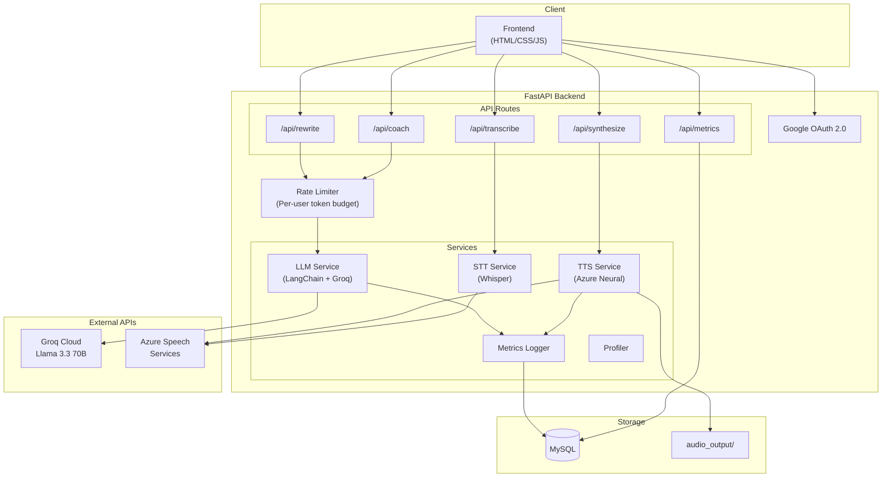

<div align="center">

# 🎙️ Cadence Coach

### AI-Powered Speech Director & Communication Coach

**Transform raw text into polished speech scripts, synthesize studio-quality audio with Azure Neural TTS, transcribe spoken audio with Whisper, and get expert AI coaching feedback — all from one platform.**

[](https://fastapi.tiangolo.com)
[](https://langchain.com)
[](https://groq.com)
[](https://azure.microsoft.com/en-us/products/ai-services/text-to-speech)
[](https://www.mysql.com)
[](https://www.docker.com)

</div>

---

## ✨ What It Does

Cadence Coach is a full-stack AI speech platform with three core modules:

| Module | Description |
|--------|-------------|
| **🎤 Speech Director (VOXIS)** | Rewrite any text into a polished speech script matching a target speaking style (TED Talk, Morgan Freeman, etc.), then synthesize it to audio with Azure Neural TTS. |
| **📊 Communication Coach** | Paste text or upload audio for deep AI analysis — vocabulary strength, tone & emotion, voice modulation, pacing, emphasis, clarity — with actionable coaching feedback and scores. |
| **📈 Analytics Dashboard** | Real-time observability: LLM token usage, latency, cost tracking, TTS metrics, per-endpoint breakdowns, and recent call timelines. |

---

## 🏗️ Architecture



---

## 🛠️ Tech Stack

| Layer | Technology |
|-------|-----------|
| **Backend Framework** | [FastAPI](https://fastapi.tiangolo.com) with async Python |
| **LLM Orchestration** | [LangChain](https://langchain.com) + [Groq](https://groq.com) (Llama 3.3 70B Versatile) |
| **Text-to-Speech** | [Azure Cognitive Services Speech SDK](https://azure.microsoft.com/en-us/products/ai-services/text-to-speech) (Neural voices) |
| **Speech-to-Text** | [OpenAI Whisper](https://github.com/openai/whisper) via Groq |
| **Database** | MySQL 8.0 with connection pooling |
| **Authentication** | Google OAuth 2.0 via [Authlib](https://authlib.org) |
| **Frontend** | Vanilla HTML/CSS/JS with glassmorphism dark theme |
| **Containerization** | Docker |
| **Rate Limiting** | Custom sliding-window token budget (per-user, MySQL-backed) |

---

## 🚀 Getting Started

### Prerequisites

- **Python 3.11+**
- **MySQL 8.0+** running locally (or a remote instance)
- **API Keys**: Groq, Azure Speech Services, Google OAuth credentials

### 1. Clone & Install

```bash
git clone https://github.com/your-username/cadence-coach.git
cd cadence-coach

# Create virtual environment
python -m venv myenv
source myenv/bin/activate    # Linux/macOS
myenv\Scripts\activate       # Windows

# Install dependencies
pip install -r requirements.txt
```

### 2. Configure Environment

Create a `.env` file in the project root:

```env
# LLM
GROQ_API_KEY=gsk_your_groq_api_key_here

# Azure Speech
AZURE_SPEECH_KEY=your_azure_speech_key_here
AZURE_SPEECH_REGION=centralindia

# Google OAuth
GOOGLE_CLIENT_ID=your_client_id.apps.googleusercontent.com
GOOGLE_CLIENT_SECRET=GOCSPX-your_secret_here
SESSION_SECRET_KEY=your_random_session_secret
OAUTH_REDIRECT_URI=http://localhost:8000/api/auth/callback

# MySQL
MYSQL_HOST=localhost
MYSQL_PORT=3306
MYSQL_USER=root
MYSQL_PASSWORD=your_mysql_password
MYSQL_DATABASE=cadence_coach

# Rate Limiting (optional)
RATE_LIMIT_TOKENS_PER_HOUR=100000
RATE_LIMIT_WINDOW_SECONDS=3600
```

### 3. Start MySQL

Make sure your MySQL server is running and accessible with the credentials above. The application will auto-create the `cadence_coach` database and all required tables on startup.

### 4. Run the Server

```bash
python run.py
```

The app will be available at:
- **Frontend**: [http://localhost:8000](http://localhost:8000)
- **API Docs (Swagger)**: [http://localhost:8000/docs](http://localhost:8000/docs)
- **ReDoc**: [http://localhost:8000/redoc](http://localhost:8000/redoc)

### 5. Docker (Alternative)

```bash
docker build -t cadence-coach .
docker run --env-file .env -p 8000:8000 cadence-coach
```

---

## 📡 API Documentation

FastAPI auto-generates interactive API documentation. Once running, visit:

| Format | URL |
|--------|-----|
| **Swagger UI** | [http://localhost:8000/docs](http://localhost:8000/docs) |
| **ReDoc** | [http://localhost:8000/redoc](http://localhost:8000/redoc) |
| **OpenAPI JSON** | [http://localhost:8000/openapi.json](http://localhost:8000/openapi.json) |

### Key Endpoints

| Method | Endpoint | Description |
|--------|----------|-------------|
| `POST` | `/api/rewrite` | Rewrite text into a polished speech script |
| `POST` | `/api/rewrite-and-speak` | Rewrite + synthesize audio (end-to-end) |
| `POST` | `/api/synthesize` | Text-to-speech synthesis (returns MP3) |
| `POST` | `/api/coach` | Full communication coaching analysis |
| `POST` | `/api/transcribe` | Audio-to-text transcription with speaking metrics |
| `GET`  | `/api/voices` | List available Azure Neural voices |
| `GET`  | `/api/metrics` | LLM & TTS observability dashboard data |
| `GET`  | `/api/health` | Health check |
| `GET`  | `/api/auth/login` | Initiate Google OAuth login |
| `GET`  | `/api/auth/me` | Check current auth session |
| `GET`  | `/api/auth/usage` | Token rate-limit usage for current user |

---

## 📁 Project Structure

```
cadence-coach/
├── app/
│   ├── main.py              # FastAPI app, middleware, OAuth, route mounting
│   ├── config.py             # Centralized env-var configuration
│   ├── models/
│   │   └── schemas.py        # Pydantic request/response models
│   ├── routes/
│   │   ├── rewrite.py        # /api/rewrite endpoint
│   │   ├── synthesize.py     # /api/synthesize, /api/rewrite-and-speak
│   │   ├── coach.py          # /api/coach endpoint
│   │   ├── transcribe.py     # /api/transcribe endpoint
│   │   ├── voices.py         # /api/voices endpoint
│   │   └── metrics.py        # /api/metrics endpoint
│   ├── services/
│   │   ├── llm.py            # LangChain + Groq LLM invocation with profiling
│   │   ├── tts.py            # Azure Neural TTS synthesis
│   │   ├── stt.py            # Whisper speech-to-text
│   │   ├── database.py       # MySQL connection pool & schema init
│   │   ├── metrics.py        # LLM/TTS metrics logging & aggregation
│   │   ├── rate_limiter.py   # Sliding-window token rate limiter
│   │   ├── user_service.py   # User CRUD (Google OAuth profiles)
│   │   └── profiler.py       # Per-step latency tracing
│   ├── prompts/
│   │   ├── voxis.py          # Speech Director prompt template
│   │   └── coach.py          # Communication Coach prompt template
│   └── utils/
│       └── parsing.py        # Shared LLM output parsing utilities
├── frontend/
│   ├── index.html            # SPA frontend
│   ├── style.css             # Glassmorphism dark theme
│   ├── app.js                # Frontend logic
│   └── nginx.conf            # Production Nginx config
├── tests/
│   ├── test_basics.py        # Basic unit tests
│   ├── test_unit.py          # Comprehensive unit tests
│   └── test_tts.py           # TTS service tests
├── run.py                    # Uvicorn dev server entry point
├── Dockerfile                # Production container
├── requirements.txt          # Pinned Python dependencies
└── .env                      # Environment variables (not committed)
```

---

## 🧪 Running Tests

```bash
# Run all tests
pytest

# Run with verbose output
pytest -v

# Run a specific test file
pytest tests/test_unit.py
```

---

## 📄 License

This project is for educational and portfolio purposes.
